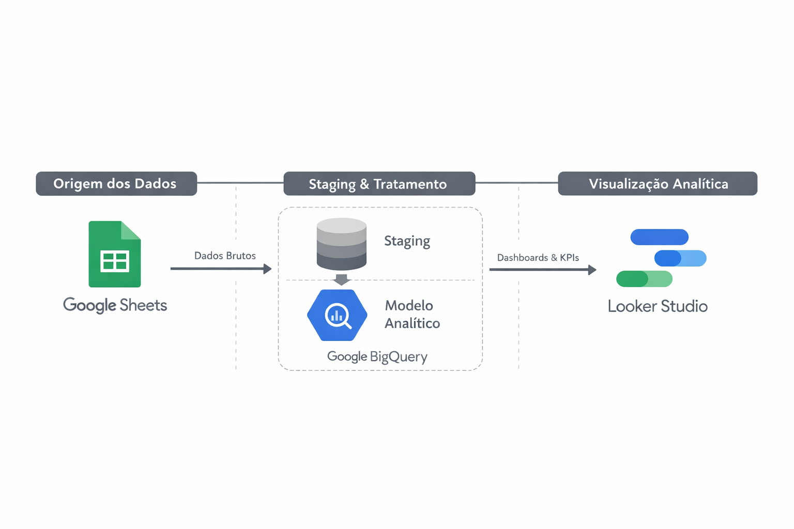
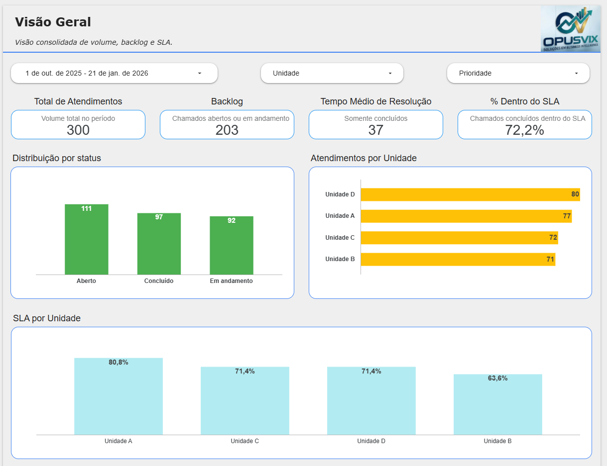
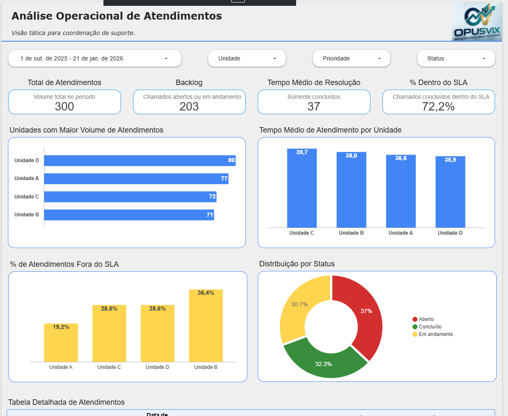

# Monitoramento de Suporte Operacional

## 🧠 Contexto do Projeto

Organizações que prestam suporte operacional precisam acompanhar volume de atendimentos, cumprimento de SLA e evolução da demanda ao longo do tempo. A falta de uma visão integrada dificulta a tomada de decisão, o planejamento de capacidade e a priorização de ações corretivas.

Este projeto simula um ambiente real de suporte operacional genérico, com dados estruturados desde a origem até a visualização analítica.

O dashboard permite acompanhar a eficiência operacional da organização, analisando volume de atendimentos, cumprimento de SLA e desempenho das unidades. A solução apoia gestores na identificação de gargalos, priorização de recursos e melhoria contínua dos serviços.

## 🎯 Objetivo

Construir um pipeline completo de BI utilizando ferramentas do ecossistema Google para:

- Centralizar dados operacionais

- Tratar e modelar informações analíticas

- Monitorar SLA, backlog e desempenho

- Apoiar decisões gerenciais e estratégicas

## 🏗️ Arquitetura da Solução

```text
Google Sheets (dados simulados)
    ↓
BigQuery (staging + modelo analítico)
    ↓
Looker Studio (Dashboards)
```
📌 O projeto prioriza boas práticas de modelagem, separação entre dados brutos e tratados e storytelling analítico.



## 🛠️ Tecnologias Utilizadas

- Google Sheets (geração e simulação de dados)

- BigQuery (armazenamento e transformação)

- SQL padrão BigQuery

- Looker Studio (visualização e análise)

- GitHub (versionamento e portfólio)

## 📊 Dashboards Desenvolvidos
### 📍 Página 1 — Visão Geral Executiva

- Volume total de atendimentos

- Tempo médio de atendimento

- SLA global

- Distribuição por status, unidade e prioridade



### 📍 Página 2 — Análise Operacional

- Volume por unidade

- Tempo médio por unidade

- SLA por unidade e prioridade

- Distribuição de status

- Tabela analítica de atendimentos



### 📍 Página 3 — Tendências & Planejamento

- Evolução da demanda ao longo do tempo

- Tendência de SLA

- Crescimento por prioridade

- Abertos vs fechados

- Apoio ao planejamento de capacidade


## 📈 Principais Insights Simulados

- Crescimento gradual da demanda ao longo dos meses

- Unidades com maior volume tendem a apresentar maior risco de violação de SLA

- Atendimentos de prioridade alta exigem reforço operacional

- Backlog crescente indica necessidade de ajuste de capacidade

## 📌 Decisões que o Dashboard Suporta

- Reforço de equipe por unidade

- Revisão de SLAs por prioridade

- Planejamento de capacidade futura

- Monitoramento contínuo da qualidade do atendimento

## 👨‍💻 Autor

### Maurício Barros
#### Analista de Dados | BI | Analytics
🔗 GitHub: https://github.com/opusvix
